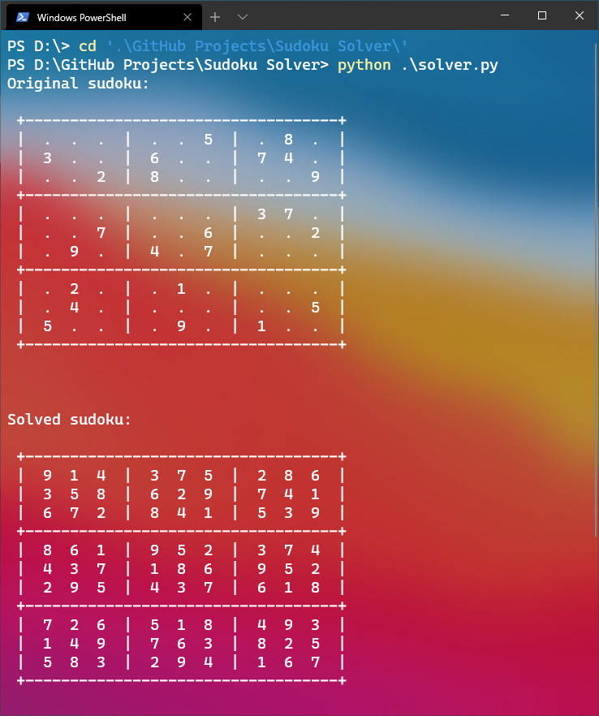

# Sudoku Solver
A simple program written in python that can solve standard sudoku puzzles of any kind of difficulty.

## Installation
You can install and run the program following these steps:
1. Download or clone this repo to your local machine using ```git clone https://github.com/Borotalcohol/SudokuSolver.git```
2. Open a terminal of your choice and navigate to the SudokuSolver folder you've just downloaded/cloned.
3. Run the script using ```python solver.py``` or ```python3 solver.py``` (be sure to have the environment variable set)

## Usage
The solver.py script already has an example of sudoku to solve in the main function,
if you want to change the sudoku to solve you have to open the script in any
IDE or text editor and edit the 2D array named "sudoku" (put 0 if the box is empty)


When you're done editing the sudoku you can run the script, this will the output:


